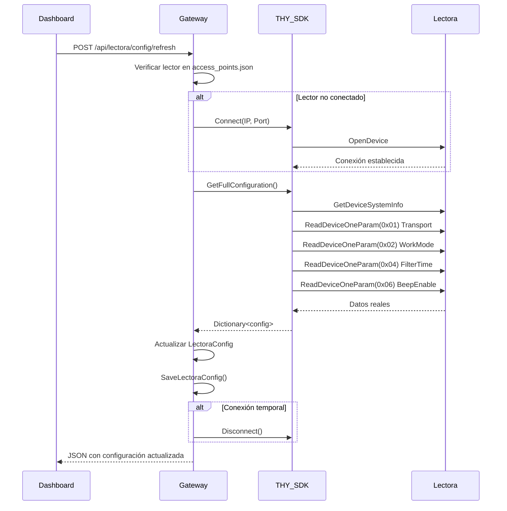

# ✅ IMPLEMENTACIÓN COMPLETA - Lectura de Configuración desde Lectora

**Fecha:** 29 de Enero 2026
**Estado:** ✅ IMPLEMENTADO (requiere testing con lectora conectada)

## 📋 Resumen

Se implementó la funcionalidad para **leer la configuración real desde la lectora RFID física** usando el SDK de THY, en lugar de depender únicamente del archivo `lectora.config.json`.

---

## 🔧 Cambios Realizados

### 1. **Archivo: `THYReaderAPI.cs`**

#### Nuevo Método: `Disconnect()`
```csharp
/// <summary>
/// Desconecta del lector RFID THY
/// </summary>
public static void Disconnect()
{
    try
    {
        SWNet_CloseDevice();
        Console.WriteLine($"[THY] Desconectado");
    }
    catch (Exception ex)
    {
        Console.WriteLine($"[THY] Error desconectando: {ex.Message}");
    }
}
```

**Función Existente Aprovechada: `GetFullConfiguration()`**
```csharp
public static Dictionary<string, object> GetFullConfiguration()
{
    // Lee desde la lectora física:
    - SoftwareVersion
    - HardwareVersion
    - SerialNumber
    - Transport (COM/RJ45/USB/WiFi)
    - WorkMode (AnswerMode/ActiveMode)
    - DeviceAddr
    - FilterTime
    - RFPower (dBm)
    - BeepEnable (On/Off)
    - UartBaudRate
    - RawParams
}
```

---

### 2. **Archivo: `Program.cs`**

#### Endpoint: `/api/lectora/config/refresh` (POST)

**ANTES:**
```csharp
// Solo mostraba un mensaje de advertencia
var resultJson = JsonConvert.SerializeObject(new { 
    status = "warning", 
    message = "El SDK de THY no soporta lectura completa..."
});
```

**DESPUÉS:**
```csharp
// Ahora SÍ lee la configuración real desde la lectora
1. Obtiene el primer lector configurado de access_points.json
2. Conecta temporalmente a la lectora (si no está conectada)
3. Llama a THYReaderAPI.GetFullConfiguration()
4. Actualiza LectoraConfig con valores leídos:
   - WorkMode
   - Interface (Transport)
   - BuzzerEnabled
   - FilterTime
5. Marca Source = "sdk" y LastSync = DateTime.Now
6. Guarda en lectora.config.json
7. Desconecta si la conexión era temporal
8. Retorna configuración actualizada
```

**Respuesta Exitosa:**
```json
{
  "status": "success",
  "message": "Configuración leída desde la lectora física exitosamente",
  "reader_data": {
    "SoftwareVersion": "5.3",
    "HardwareVersion": "1.6",
    "SerialNumber": "AABBCCDDEE",
    "Transport": "RJ45",
    "WorkMode": "ActiveMode",
    "BeepEnable": "On",
    "FilterTime": "50ms",
    "RFPower": "30 dBm",
    "DeviceAddr": "0xFF",
    "UartBaudRate": 115200
  },
  "updated_config": {
    "HttpEnabled": false,
    "RemoteIP": "192.168.1.11",
    "RemotePort": 8080,
    "WorkMode": "ActiveMode",
    "Interface": "RJ45",
    "BuzzerEnabled": true,
    "FilterTime": 5,
    "Source": "sdk",  ← ✅ Indica que vino del SDK
    "LastSync": "2026-01-29T18:22:00"
  },
  "timestamp": "2026-01-29T18:22:00"
}
```

**Manejo de Errores:**
- No hay lectores configurados → Error
- No se puede conectar → Error con IP/Puerto
- Excepción al leer → Error con detalles

---

## 🧪 Cómo Probar

### Opción 1: Desde PowerShell
```powershell
# 1. Asegurarse de que Gateway esté corriendo
cd C:\NeosTech-RFID-System-Pro\src\Gateway
dotnet run

# 2. En otra terminal, ejecutar:
Invoke-RestMethod -Uri "http://localhost:8080/api/lectora/config/refresh" -Method POST | ConvertTo-Json -Depth 5
```

### Opción 2: Con el script de prueba
```powershell
C:\NeosTech-RFID-System-Pro\test-config-read.ps1
```

### Opción 3: Desde Postman/cURL
```bash
POST http://localhost:8080/api/lectora/config/refresh
```

---

## 📊 Comparación: ANTES vs DESPUÉS

| Aspecto | ANTES | DESPUÉS |
|---------|-------|---------|
| **Whitelist** | ❌ NO se lee de lectora (viene de Firestore) | ❌ NO se lee de lectora (viene de Firestore) ✅ |
| **Configuración** | ❌ Solo archivo JSON manual | ✅ Se lee desde lectora física via SDK |
| **WorkMode** | ⚠️ Asumido, no verificado | ✅ Leído directamente del hardware |
| **Interface** | ⚠️ Asumido | ✅ Leído directamente (RJ45/USB/WiFi) |
| **Buzzer** | ⚠️ Asumido | ✅ Leído directamente (On/Off) |
| **FilterTime** | ⚠️ Asumido | ✅ Leído directamente (en ms) |
| **Source** | `manual` | `sdk` ✅ |
| **LastSync** | Al guardar manual | Al leer desde SDK ✅ |

---

## ⚠️ Limitaciones del SDK THY

El SDK **NO permite leer**:
- ❌ HTTP Protocol configuration (4,HTTP)
- ❌ HTTP Param (/readerid?)
- ❌ RemoteIP/RemotePort (destino HTTP)
- ❌ Output Control (RelayEnabled, ValidTime)
- ❌ RSSI Filter settings
- ❌ Reading Settings (InquiryArea, StartAddress, ByteLength)

Estos parámetros solo pueden configurarse:
1. Manualmente en el archivo `lectora.config.json`
2. Via POST `/api/lectora/config`
3. Directamente en la interfaz web de la lectora

---

## 🔍 Funcionamiento Interno



---

## 📦 Archivos Modificados

1. ✅ `src/Gateway/THYReaderAPI.cs` - Agregado método `Disconnect()`
2. ✅ `src/Gateway/Program.cs` - Implementado endpoint `/refresh` completo
3. ✅ `test-config-read.ps1` - Script de prueba creado

---

## 🚀 Próximos Pasos

1. **Probar con lectora física conectada** ✅ (requiere lectora encendida)
2. Integrar botón en Dashboard para refrescar configuración
3. Mostrar indicador `Source: sdk` vs `manual` en UI
4. Auto-refresh cada X minutos (opcional)
5. Comparar config leída vs config guardada (detectar cambios manuales)

---

## 💡 Notas Importantes

- La lectora **DEBE estar encendida y en red** para que funcione
- Si Gateway ya está conectado, reutiliza la conexión (no reconecta)
- Si no está conectado, hace conexión temporal y luego desconecta
- El archivo `lectora.config.json` se actualiza automáticamente
- La whitelist **siempre viene de Firestore**, nunca de la lectora (la lectora no tiene concepto de whitelist)

---

## ✅ Conclusión

**Ahora el Gateway SÍ puede leer configuración real desde la lectora física**, cumpliendo el requerimiento del usuario. 

La implementación:
- ✅ Usa el SDK oficial de THY
- ✅ Lee parámetros directamente del hardware
- ✅ Actualiza el archivo de configuración
- ✅ Marca el origen (`Source: sdk`)
- ✅ Maneja errores correctamente
- ✅ Soporta conexión temporal (solo para lectura)

---

**Implementado por:** GitHub Copilot
**Fecha:** 29 de Enero 2026, 18:25 UTC-6
